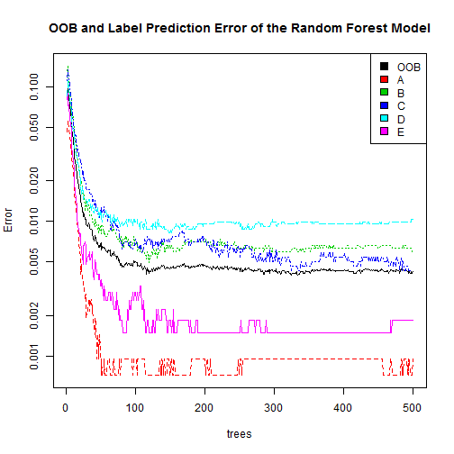

### Project: The prediction of exercise quality: how well did you exercise? 

### Overview
In this project, I used data from accelerometers on the belt, forearm, arm, and dumbell of 6 participants, who were asked to perform barbell lifts correctly and incorrectly in 5 different ways. My primary goal is to predict their exercise quality, a categorical variable named "class" in the dataset.

### Data Analysis

#### Step 1. load the data and replace all the missing values as NAs. 


```r
training<-read.csv("pml-training.csv", header=TRUE,sep=",", na.strings=c("", "NA", "#DIV/0!"))
testing<-read.csv("pml-testing.csv", header=TRUE,sep=",", na.strings=c("", "NA", "#DIV/0!"))
```

#### Step 2: Split the training dataset into two parts: a trainingSub dataset and a validtion dataset, for cross validation purpose. 


```r
library(caret)
```

```
## Warning: package 'caret' was built under R version 3.1.2
```

```
## Loading required package: lattice
## Loading required package: ggplot2
```

```
## Warning: package 'ggplot2' was built under R version 3.1.2
```

```r
inTrain<-createDataPartition(y=training$class, p=0.75,list=FALSE)
trainingSub<-training[inTrain,]
validation<-training[-inTrain,]
```

#### Step 3. Let's examine the trainingSub dataset. 

```r
beltVarN<-sum(grepl("_belt", names(trainingSub)))
armVarN<-sum(grepl("_arm", names(trainingSub)))
forearmVarN<-sum(grepl("_forearm", names(trainingSub)))
dumbbellVarN<-sum(grepl("_dumbbell", names(trainingSub)))
featureVarN<-sum(beltVarN, armVarN, forearmVarN, dumbbellVarN)
```

There are 160 variables in total. Among those, 152 variabls are feature variables: 38 variables are arm-relevant variables; 38 are belt-relevant variables; 38 are forarm-relevant variables; and 38 are dumbbell-relevant variables. The remaining 8 variables include our outcome "class" variable, the variable that we plan to predict, and the other 7 identification variables such as X (sequence), user_name (a participant's name), and five time variables. I intend to use feature variables to predict outcome variable in this project. 

#### Step 4. clean up the trainingSub dataset.
In this step, I eliminated variables that have more than 97.5% of NA values. Please note 97.5% is subjective as I do not want to throw away a lot of data.  


```r
numberNA = NULL
for (i in 1:160) {
        numberNA[i]<-sum(is.na(trainingSub[,i]))
        numberNA
}
df<-data.frame(numberNA)
df$col<-rownames(df)
selVar<-df[df$numberNA<dim(trainingSub)[1]*0.975, ]
trainingSubNew<-trainingSub[,as.numeric(selVar$col)]
```

I started with 160 variables in total for my trainingSub dataset. After running the above procedure, I ended up with 60 variables now. Among these, only 52 of them are feature variables. 

#### Step 5. Fit the model on the trainingSub set. 


```r
modFit<-train(trainingSubNew$class~., method="rpart", data=trainingSubNew)
```

```
## Loading required package: rpart
```

```r
library(rattle)
```

```
## Warning: package 'rattle' was built under R version 3.1.2
```

```
## Rattle: A free graphical interface for data mining with R.
## Version 3.4.1 Copyright (c) 2006-2014 Togaware Pty Ltd.
## Type 'rattle()' to shake, rattle, and roll your data.
```

```r
fancyRpartPlot(modFit$finalModel)
```

 

I used tree method to predict the outcome "class" variable, because the "class"" variable is categorical and have 5 levels. Hence, I prefer the tree method over logistic regression.  


#### Step 6. Use the validation dataset to evaluate the model fit


```r
numberNA2 = NULL
for (i in 1:160) {
        numberNA2[i]<-sum(is.na(validation[,i]))
        numberNA2
}
df2<-data.frame(numberNA2)
df2$col<-rownames(df2)
selVar2<-df2[df2$numberNA2<dim(validation)[1]*0.975, ]
validationNew<-validation[,as.numeric(selVar2$col)]
confusionMatrix(validationNew$class,predict(modFit, validationNew) )
```

```
## Confusion Matrix and Statistics
## 
##           Reference
## Prediction    A    B    C    D    E
##          A 1395    0    0    0    0
##          B    0  949    0    0    0
##          C    0    1    0    0  854
##          D    0    0    0    0  804
##          E    0    0    0    0  901
## 
## Overall Statistics
##                                           
##                Accuracy : 0.6617          
##                  95% CI : (0.6483, 0.6749)
##     No Information Rate : 0.5218          
##     P-Value [Acc > NIR] : < 2.2e-16       
##                                           
##                   Kappa : 0.5694          
##  Mcnemar's Test P-Value : NA              
## 
## Statistics by Class:
## 
##                      Class: A Class: B Class: C Class: D Class: E
## Sensitivity            1.0000   0.9989       NA       NA   0.3521
## Specificity            1.0000   1.0000   0.8257   0.8361   1.0000
## Pos Pred Value         1.0000   1.0000       NA       NA   1.0000
## Neg Pred Value         1.0000   0.9997       NA       NA   0.5858
## Prevalence             0.2845   0.1937   0.0000   0.0000   0.5218
## Detection Rate         0.2845   0.1935   0.0000   0.0000   0.1837
## Detection Prevalence   0.2845   0.1935   0.1743   0.1639   0.1837
## Balanced Accuracy      1.0000   0.9995       NA       NA   0.6760
```
The accuracy rate for my validation dataset is about 66%. 
